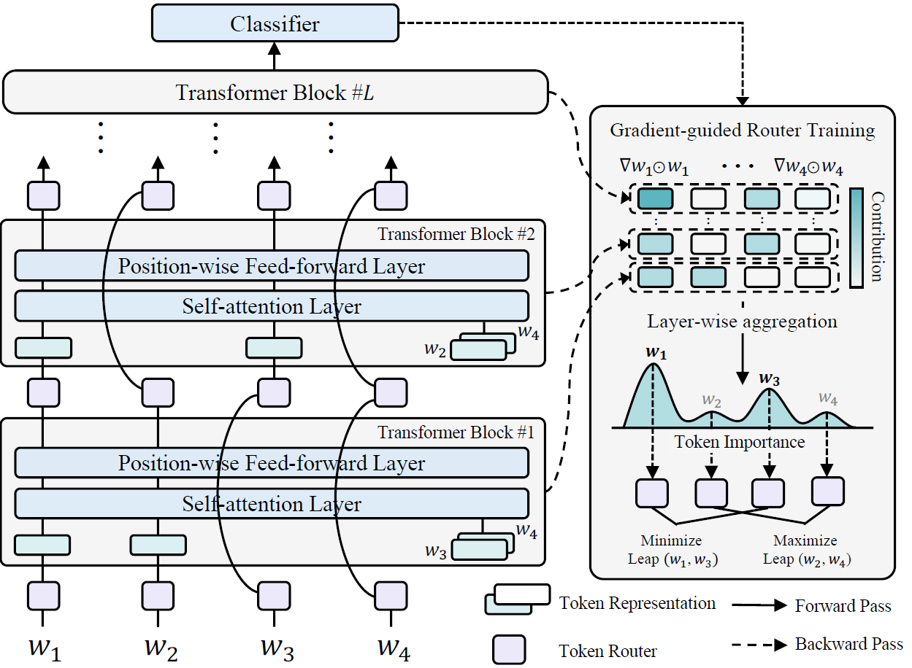

# Leap-of-Thought: Accelerating Transformers via Dynamic Token Routing

### Pytorch implementations of "Leap-of-Thought: Accelerating Transformers via Dynamic Token Routing" (EMNLP 2023)
<p align='center'>
    
</p>


### Training LoT

**Step1: Derive the token importance on each task**

Similar to AdapLer, we first derive the gradient information from each task. Running code about fine-tuning/saliency maps (in AdapLer directory) results in the importance distribution of each token.


**Step2: Train LoT with the derived importance**
Running 
~~~
python -u ./main.py  \
    --dataset 'sst2' \
    --model 'bert-base-uncased' \
    --alg 'lot' \
    --task_grad [resulting filepath from Step1] \
    --batch_size 32 \
    --reg_weight 0.05 \
    --top_p 0.3 \
    --max_seq_len 64 \
    --epochs 5 \
    --device $1 \
    --logging_step 200 \
    --lr 2e-5 \
    --init_seed 42

~~~


### Citation

```bibtex
@inproceedings{kim-etal-2023-leap,
    title = "Leap-of-Thought: Accelerating Transformers via Dynamic Token Routing",
    author = "Kim, Yeachan  and
      Kim, Junho  and
      Park, Jun-Hyung  and
      Lee, Mingyu  and
      Lee, SangKeun",
    editor = "Bouamor, Houda  and
      Pino, Juan  and
      Bali, Kalika",
    booktitle = "Proceedings of the 2023 Conference on Empirical Methods in Natural Language Processing",
    month = dec,
    year = "2023",
    address = "Singapore",
    publisher = "Association for Computational Linguistics",
    url = "https://aclanthology.org/2023.emnlp-main.976",
    doi = "10.18653/v1/2023.emnlp-main.976",
    pages = "15757--15769",
}

```
